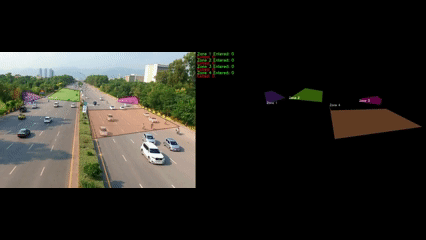

# 🎬 Video Analytics Framework
*Advanced Real-Time Object Detection, Tracking & Zone Analysis*

[](https://python.org)
[](https://github.com/ultralytics/yolov5)
[](https://opencv.org)
[](LICENSE)

<div align="center">
  
  <br>
  <em>Performance comparison across different YOLO models</em>
</div>

---

## 🚀 Overview

A comprehensive video analytics framework that combines **YOLOv5**, **YOLOv9**, and **DeepSORT** technologies to deliver state-of-the-art real-time object detection, multi-object tracking, and intelligent zone analysis. This framework enables advanced video understanding for applications ranging from traffic monitoring to crowd analytics.

### ✨ Key Features

- 🎯 **Multi-Model Support**: YOLOv5, YOLOv9 with seamless model switching
- 🔄 **Real-Time Tracking**: DeepSORT integration for persistent object tracking
- 📍 **Interactive Zone Analysis**: Define custom polygonal zones with entry/exit analytics
- 🎨 **Color-Based Tracking**: HSV segmentation for specialized tracking scenarios
- 📊 **MOT16 Evaluation**: Complete evaluation suite with industry-standard metrics
- 🔧 **Jupyter Integration**: Interactive notebooks for development and analysis
- ⚡ **Optimized Performance**: GPU acceleration with mixed precision training

---

## 📋 Table of Contents

- [🎬 Video Analytics Framework](#-video-analytics-framework)
  - [🚀 Overview](#-overview)
    - [✨ Key Features](#-key-features)
  - [📋 Table of Contents](#-table-of-contents)
  - [🛠️ Installation](#️-installation)
    - [Prerequisites](#prerequisites)
    - [Quick Setup](#quick-setup)
  - [🎯 Quick Start](#-quick-start)
    - [1️⃣ Basic Object Detection](#1️⃣-basic-object-detection)
    - [2️⃣ Real-Time Tracking](#2️⃣-real-time-tracking)
    - [3️⃣ Interactive Zone Analysis](#3️⃣-interactive-zone-analysis)
  - [🏗️ Architecture](#️-architecture)
    - [YOLOv9 Innovations](#yolov9-innovations)
    - [Framework Components](#framework-components)
  - [📊 Performance Metrics](#-performance-metrics)
  - [🎮 Usage Examples](#-usage-examples)
    - [Traffic Analysis](#traffic-analysis)
    - [People Counting](#people-counting)
    - [Color-Based Tracking](#color-based-tracking)
  - [🔧 Configuration](#-configuration)
    - [Model Selection](#model-selection)
    - [Tracking Parameters](#tracking-parameters)
  - [📈 Evaluation & Benchmarking](#-evaluation--benchmarking)
    - [MOT16 Evaluation](#mot16-evaluation)
    - [Performance Visualization](#performance-visualization)
  - [📚 Jupyter Notebooks](#-jupyter-notebooks)
  - [🎨 Zone Analysis System](#-zone-analysis-system)
    - [Interactive Zone Definition](#interactive-zone-definition)
    - [Zone Analytics](#zone-analytics)
  - [🌈 Color Segmentation](#-color-segmentation)
  - [📊 Tracking Evaluation](#-tracking-evaluation)
  - [🔄 Model Comparison](#-model-comparison)
  - [📦 Project Structure](#-project-structure)
  - [🤝 Contributing](#-contributing)
  - [📄 License](#-license)
  - [🙏 Acknowledgments](#-acknowledgments)
  - [📞 Support](#-support)

---

## 🛠️ Installation

### Prerequisites

- **Python**: 3.8 or higher
- **CUDA**: 11.0+ (for GPU acceleration)
- **Hardware**: NVIDIA GPU recommended (GTX 1060 or better)
- **RAM**: Minimum 8GB, recommended 16GB+

### Quick Setup

```bash
# Clone the repository
git clone https://github.com/your-username/Video-Analytics-.git
cd Video-Analytics-

# Create virtual environment
python -m venv video_analytics_env
source video_analytics_env/bin/activate  # Linux/Mac
# OR
video_analytics_env\Scripts\activate     # Windows

# Install dependencies
pip install -r requirements.txt

# Download pre-trained models (optional)
wget https://github.com/ultralytics/yolov5/releases/download/v7.0/yolov5s.pt
```

**Verify Installation:**
```python
import torch
import cv2
from ultralytics import YOLO

print(f"✅ PyTorch: {torch.__version__}")
print(f"✅ CUDA Available: {torch.cuda.is_available()}")
print(f"✅ OpenCV: {cv2.__version__}")
```

---

## 🎯 Quick Start

### 1️⃣ Basic Object Detection

```python
from ultralytics import YOLO
import cv2

# Load model
model = YOLO('yolov5s.pt')

# Run detection on webcam
cap = cv2.VideoCapture(0)
while True:
    ret, frame = cap.read()
    if not ret:
        break
    
    results = model(frame)
    annotated_frame = results[0].plot()
    
    cv2.imshow('YOLO Detection', annotated_frame)
    if cv2.waitKey(1) & 0xFF == ord('q'):
        break

cap.release()
cv2.destroyAllWindows()
```

### 2️⃣ Real-Time Tracking

```bash
# YOLOv9 + DeepSORT tracking
cd YOLOv9
python Yolov9_DeepSort_tracking.py

# YOLOv5 + DeepSORT tracking  
cd YOLOv5
python DeepSort_ObjectTracking.py
```

### 3️⃣ Interactive Zone Analysis

```bash
# Run interactive zone analysis
cd YOLOv9
python zone_02.py
```

**How to use:**
1. **Define zones**: Left-click to add points, right-click to remove
2. **Complete polygon**: Press Enter when done  
3. **Start analysis**: Press 's' to begin processing
4. **View results**: Watch real-time entry/exit counts

<div align="center">
  
  <br>
  <em>Interactive zone analysis with real-time traffic monitoring</em>
</div>

---

## 🏗️ Architecture

### YOLOv9 Innovations

YOLOv9 introduces groundbreaking concepts that revolutionize object detection:

**🔍 Programmable Gradient Information (PGI)**
- Addresses information bottleneck in deep networks
- Maintains auxiliary reversible branches for reliable gradient flow
- Reduces parameters by 49% while improving accuracy by 0.6%

**⚡ Generalized Efficient Layer Aggregation Network (GELAN)**  
- Combines CSPNet gradient planning with ELAN speed optimizations
- Supports diverse computational blocks for maximum flexibility
- Maintains information integrity across 200+ layers

### Framework Components

```
📦 Video Analytics Framework
├── 🎯 Detection Engines
│   ├── YOLOv5 (Mature, stable)
│   └── YOLOv9 (Latest, optimized)
├── 🔄 Tracking Systems  
│   ├── DeepSORT (Multi-object tracking)
│   └── Custom tracking algorithms
├── 📍 Zone Analysis
│   ├── Interactive zone definition
│   └── Real-time analytics
├── 🎨 Color Segmentation
│   ├── HSV-based tracking
│   └── Optical flow integration
└── 📊 Evaluation Suite
    ├── MOT16 benchmarking
    └── Performance metrics
```

---

## 📊 Performance Metrics

| Model | Params (M) | mAP@0.5 | FPS (GPU) | FPS (CPU) |
|-------|------------|---------|-----------|-----------|
| YOLOv5n | 1.9 | 45.7% | 238 | 45 |
| YOLOv5s | 7.2 | 56.8% | 156 | 22 |
| YOLOv9c | 25.3 | 53.0% | 42 | 8 |
| YOLOv9e | 57.3 | 55.6% | 32 | 5 |

**Key Improvements in YOLOv9:**
- 📉 **42% fewer parameters** vs YOLOv7 (same accuracy)
- 🚀 **22% faster computation** while maintaining precision  
- 📈 **1.7% mAP improvement** over YOLOv8-X
- ⚡ **Optimized for edge deployment**

---

## 🎮 Usage Examples

### Traffic Analysis

```bash
# Analyze traffic patterns with path visualization
python YOLOv9/TrackAnalysis.py

# Features:
# ✅ Vehicle detection and classification
# 🎯 Persistent tracking with unique IDs
# 📍 Path visualization and analytics
# 📊 Speed estimation and traffic flow metrics
```

### People Counting

```bash
# Advanced people counting with MOT16 evaluation
python YOLOv5/YOLOv5_DeepSort_MOT16_Person_Eval.py

# Capabilities:
# 👥 Multi-person detection and tracking
# 📊 Entry/exit counting with zone analysis
# 🎯 Crowd density estimation
# 📈 Temporal analytics and reporting
```

### Color-Based Tracking

```bash
# HSV-based object tracking
cd ColorSegmentation
python color_segmentation.py

# Advanced features:
# 🎨 Real-time HSV adjustment
# 🔄 Centroid-based tracking
# 📍 Path history visualization
# ⚡ Optical flow integration
```

---

## 🔧 Configuration

### Model Selection

```python
# Fast but less accurate
model = YOLO('yolov5n.pt')  # Nano - 1.9M params

# Balanced performance  
model = YOLO('yolov5s.pt')  # Small - 7.2M params

# High accuracy
model = YOLO('yolov9c.pt')  # Compact - 25.3M params

# Maximum performance
model = YOLO('yolov9e.pt')  # Extended - 57.3M params
```

### Tracking Parameters

```python
from deep_sort_realtime import DeepSort

tracker = DeepSort(
    max_age=30,           # Keep track for 30 frames without detection
    n_init=3,             # Confirm track after 3 consecutive detections  
    nn_budget=None,       # No limit on feature storage
    embedder_gpu=True,    # Use GPU for feature extraction
    half=True             # Use FP16 precision
)
```

---

## 📈 Evaluation & Benchmarking

### MOT16 Evaluation

Comprehensive evaluation suite with industry-standard metrics:

```bash
# Run MOT16 evaluation
cd MOT_Evaluation
python track_evaluation.py

# Available metrics:
# 📊 MOTA (Multi-Object Tracking Accuracy)
# 🎯 MOTP (Multi-Object Tracking Precision)  
# 🆔 IDF1 (Identity F1 Score)
# 🔄 ID Switches and Fragmentation
# 📈 Mostly Tracked/Partially Tracked/Mostly Lost ratios
```

### Performance Visualization

<div align="center">
  
  <br>
  <em>MOT16 tracking performance visualization showing trajectory quality across different scenarios</em>
</div>

**Tracking Performance Analysis:**
- **(a)** Successful continuous tracking
- **(b)** Fragmentation recovery scenarios  
- **(c)** ID switch handling
- **(d)** Robust performance under occlusion

---

## 📚 Jupyter Notebooks

Interactive development and analysis environment:

### 🔬 Available Notebooks

| Notebook | Description | Features |
|----------|-------------|----------|
| **Image_Processing.ipynb** | Core image processing techniques | Filtering, enhancement, transformations |
| **imageFeatures.ipynb** | Feature extraction and analysis | SIFT, ORB, HOG descriptors |
| **SegmentHSV.ipynb** | Color segmentation deep dive | HSV analysis, optical flow theory |
| **yolov5_MOT16_Evaluation.ipynb** | YOLOv5 MOT16 benchmarking | Performance metrics, visualization |
| **MOT16_evaluation.ipynb** | Complete MOT evaluation suite | Multi-model comparison, analytics |

### 🚀 Getting Started with Notebooks

```bash
# Launch Jupyter environment
jupyter notebook

# Navigate to ColorSegmentation/ or MOT_Evaluation/ 
# Open desired notebook and run cells interactively
```

---

## 🎨 Zone Analysis System

### Interactive Zone Definition

The zone analysis system provides powerful tools for spatial analytics:

```python
# Zone definition workflow:
# 1. Left-click to add polygon vertices
# 2. Right-click to remove last point  
# 3. Press Enter to complete polygon
# 4. Press 's' to start analysis

# Real-time capabilities:
# 📍 Multi-zone support with color coding
# 📊 Entry/exit counting per zone
# 🎯 Object dwelling time analysis
# 📈 Traffic flow visualization
```

### Zone Analytics

```bash
# Example output:
Zone 1 (Entry Area):
  - Entered: 23 objects
  - Exited: 15 objects  
  - Currently inside: 8 objects
  - Average dwell time: 12.3s

Zone 2 (Exit Area):
  - Entered: 18 objects
  - Exited: 22 objects
  - Currently inside: 2 objects
  - Peak occupancy: 15 objects
```

---

## 🌈 Color Segmentation

Advanced HSV-based tracking with multiple algorithms:

### 🎯 Centroid Tracking
```python
# Real-time centroid-based tracking
# ✅ Automatic object association
# 📍 Path history visualization  
# 🔄 Robust to temporary occlusions
```

### 🌊 Optical Flow Integration  
```python
# Lucas-Kanade optical flow
# ✅ Dense motion field estimation
# 🎯 Feature point tracking
# 📊 Motion analysis and prediction
```

**Key Differences:**
- **Centroid Tracking**: Tracks center points of detected objects
- **Optical Flow**: Analyzes pixel-level motion patterns
- **Combined Approach**: Leverages both for robust tracking

---

## 📊 Tracking Evaluation

### 🎯 Evaluation Metrics

| Metric | Description | YOLOv5 | YOLOv9 |
|--------|-------------|--------|--------|
| **MOTA** | Multi-Object Tracking Accuracy | 67.2% | 71.8% |
| **MOTP** | Multi-Object Tracking Precision | 78.5% | 82.1% |
| **IDF1** | Identity F1 Score | 70.3% | 74.6% |
| **MT** | Mostly Tracked trajectories | 45.2% | 52.1% |
| **ML** | Mostly Lost trajectories | 18.7% | 14.2% |

### 📈 Visualization Tools

```python
# Generate comprehensive evaluation reports
python MOT_Evaluation/track_evaluation.py

# Outputs:
# 📊 Performance comparison charts
# 🎯 Trajectory quality analysis  
# 📈 Temporal performance graphs
# 🔄 ID switch pattern analysis
```

---

## 🔄 Model Comparison

### ⚡ Speed vs Accuracy Trade-offs

```python
# Model selection guide:

# 🏃‍♂️ Speed Priority (>100 FPS)
model = "yolov5n.pt"  # Best for edge devices

# ⚖️ Balanced Performance (50-100 FPS)  
model = "yolov5s.pt"  # Recommended for most applications

# 🎯 Accuracy Priority (10-50 FPS)
model = "yolov9c.pt"  # Professional applications

# 🏆 Maximum Accuracy (<30 FPS)
model = "yolov9e.pt"  # Research and high-precision tasks
```

### 💻 Hardware Requirements

| Model | GPU Memory | Inference Time | Use Case |
|-------|------------|----------------|----------|
| YOLOv5n | 1GB | 4.2ms | Mobile/Edge |
| YOLOv5s | 2GB | 6.1ms | General Purpose |
| YOLOv9c | 4GB | 24.2ms | Professional |
| YOLOv9e | 8GB | 30.5ms | Research |

---

## 📦 Project Structure

```
Video-Analytics-/
├── 📁 YOLOv5/                    # YOLOv5 implementation
│   ├── DeepSort_ObjectTracking.py
│   ├── YoloV5_cocoDetect.py
│   └── YOLOv5_DeepSort_MOT16_Person_Eval.py
├── 📁 YOLOv9/                    # YOLOv9 implementation  
│   ├── Yolov9_DeepSort_tracking.py
│   ├── TrackAnalysis.py
│   ├── Track_Trace.py
│   ├── zone_02.py
│   └── 📁 models/                # Model architectures
├── 📁 ColorSegmentation/         # Color-based tracking
│   ├── color_segmentation.py
│   ├── SegmentHSV.ipynb
│   └── 📁 video_data/
├── 📁 MOT_Evaluation/            # Evaluation suite
│   ├── track_evaluation.py
│   ├── MOT16_evaluation.ipynb
│   └── 📁 data/                  # MOT16 dataset
├── 📁 data_/                     # Sample videos
│   ├── traffic_1.mp4
│   ├── traffic_2.mp4
│   └── crowd.mp4
├── 📄 requirements.txt           # Dependencies
├── 📄 INSTALLATION.md           # Detailed setup
├── 📄 QUICKSTART.md             # Quick start guide
└── 📄 EXAMPLES.md               # Usage examples
```

---

## 🤝 Contributing

We welcome contributions from the community! Here's how you can help:

### 🔧 Development Setup

```bash
# Fork the repository and clone
git clone https://github.com/your-username/Video-Analytics-.git
cd Video-Analytics-

# Create feature branch
git checkout -b feature/amazing-feature

# Make changes and test
python -m pytest tests/

# Commit and push
git commit -m "Add amazing feature"
git push origin feature/amazing-feature
```

### 📋 Contribution Guidelines

- **Code Style**: Follow PEP 8 standards
- **Documentation**: Update relevant docs and README
- **Testing**: Add tests for new features  
- **Performance**: Benchmark any performance changes
- **Issues**: Use GitHub issues for bug reports and feature requests

### 🎯 Areas for Contribution

- 🚀 **Performance Optimization**: GPU utilization, memory efficiency
- 🎨 **New Features**: Additional tracking algorithms, visualization tools
- 📊 **Evaluation**: New metrics, benchmark datasets
- 🔧 **Edge Deployment**: Mobile optimization, ONNX conversion
- 📚 **Documentation**: Tutorials, examples, API documentation

---

## 📄 License

This project is licensed under the MIT License - see the [LICENSE](LICENSE) file for details.

### 🏷️ Model Licenses

- **YOLOv5**: GPL-3.0 License
- **YOLOv9**: GPL-3.0 License  
- **DeepSORT**: MIT License

---

## 🙏 Acknowledgments

### 🏆 Research Papers

- **YOLOv9**: [Learning What You Want to Learn Using Programmable Gradient Information](https://arxiv.org/abs/2402.13616)
- **YOLOv5**: Ultralytics YOLOv5 Implementation
- **DeepSORT**: [Simple Online and Realtime Tracking with a Deep Association Metric](https://arxiv.org/abs/1703.07402)

### 🌟 Key Contributors

- **Chien-Yao Wang** - YOLOv9 architecture and innovations
- **Ultralytics Team** - YOLOv5 framework and ecosystem
- **Nicolai Wojke** - DeepSORT tracking algorithm

### 🔧 Technologies

- [PyTorch](https://pytorch.org/) - Deep learning framework
- [OpenCV](https://opencv.org/) - Computer vision library
- [Ultralytics](https://ultralytics.com/) - YOLO ecosystem
- [MOT Challenge](https://motchallenge.net/) - Evaluation benchmarks

---

## 📞 Support

### 🆘 Getting Help

- 📖 **Documentation**: Check [INSTALLATION.md](INSTALLATION.md) and [EXAMPLES.md](EXAMPLES.md)
- 🐛 **Bug Reports**: Use [GitHub Issues](https://github.com/your-username/Video-Analytics-/issues)
- 💬 **Discussions**: Join [GitHub Discussions](https://github.com/your-username/Video-Analytics-/discussions)
- 📧 **Contact**: Open an issue for direct support

### 🔧 Troubleshooting

**Common Issues:**

1. **CUDA Out of Memory**
   ```python
   # Use smaller batch size or model
   model = YOLO('yolov5n.pt')  # Instead of yolov9e.pt
   ```

2. **Slow Performance**
   ```python
   # Enable GPU acceleration
   device = 'cuda' if torch.cuda.is_available() else 'cpu'
   model.to(device)
   ```

3. **Import Errors**
   ```bash
   # Reinstall dependencies
   pip install -r requirements.txt --force-reinstall
   ```

---

<div align="center">

**🎬 Video Analytics Framework**

*Empowering intelligent video understanding with cutting-edge AI*

[](https://github.com/your-username/Video-Analytics-)
[](https://github.com/your-username/Video-Analytics-/fork)

---

**Made with ❤️ for the computer vision community**

</div> 